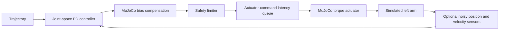

# DeepAware OpenArm v2 simulation

## 1. Result summary

This repository provides a deterministic, headless-first MuJoCo simulation of
the OpenArm v2 left seven-DoF arm. A named joint/actuator mapping drives an
in-memory torque interface with joint-space PD and MuJoCo bias-force
compensation, explicit safety supervision, measured baseline and controlled
8 ms latency/noise experiments, 57 deterministic tests, and a proposed (not
hardware-verified) SocketCAN bridge. The baseline completed 3,001 samples with
`0.00526052 rad` overall RMS error, zero command saturation, zero safety faults,
and no non-finite samples.

## 2. Tasks prioritized

1. Official-model and physical-parameter provenance.
2. Correct named model mapping and torque-interface verification.
3. A minimal PD-plus-bias tracking experiment with explicit safety faults.
4. Reproducible baseline and 8 ms latency/noise comparison.
5. Deterministic regression tests and a defensible hardware/CI design.

## 3. Why these tasks were prioritized

Incorrect coordinates, actuator semantics, or limits can invalidate every
downstream result. The work therefore establishes evidence and failure behavior
before adding experiments. The latency/noise case is intentionally narrow: it
tests one controlled robustness question without implying hardware fidelity.
ROS, IK, manipulation, grippers, and the right arm remain out of scope.

## 4. Demo


https://github.com/user-attachments/assets/fadfa0df-fbe2-4a02-965e-4b3839097aac

<video src="[https://github.com/<user>/<repo>/assets/<id>/<uuid>.mp4](https://github.com/JeffreyYijiWang/deepaware-openarm-sim/raw/refs/heads/main/results/demo.mp4)" controls width="720"></video>
[Download the generated 1280x720 H.264 demo](results/demo.mp4), or inspect the
[baseline-versus-latency plot](results/baseline_vs_latency.png). 

The recorder first reports the MJCF offscreen buffer (`640x480` in the selected
model), expands it in memory, and passes an explicit `1280x720` size to
`mujoco.Renderer`; it does not edit the vendor model.

# AI-agent workflow summary

OpenAI Codex was used as the primary implementation agent with evidence-first
increments: inspect sources, encode provenance, implement one bounded subsystem,
run tests/experiments, inspect artifacts, and revise claims. No secondary agent
was used. Three verbatim prompt excerpts and the complete verification ledger
are in the workflow document. Two concrete examples of the review loop were:

- `pytest` raised `desired_discontinuity` inside the supposed single-transient
  test, revealing that its desired-state stimulus accidentally violated a
  different rule; the stimulus was corrected while the rule stayed intact.
- the 1280x720 render check failed with `Image width 1280 > framebuffer width
  640`; inspecting `model.vis.global_` exposed the buffer mismatch, and the
  corrected run plus `ffprobe` and decoded frames verified the final output.

The named tests and commands, what was inspected manually, what was explicitly
not trusted, detection symptoms, corrections, and remaining uncertainty are in
[`docs/AI_WORKFLOW.md`](docs/AI_WORKFLOW.md).


## 5. Architecture



Baseline bypasses the latency/noise injections exactly. In the perturbation
mode, constrained actuator torque is delayed; the desired trajectory is not.

## 6. Quick start

These PowerShell commands were rerun successfully from the repository root on
Python 3.11:

```powershell
py -3.11 -m venv .review-venv
.\.review-venv\Scripts\python.exe -m pip install -r requirements.txt
.\.review-venv\Scripts\python.exe -m src.experiment --mode baseline --headless --output results/baseline
.\.review-venv\Scripts\python.exe -m pytest -q
```

Linux/macOS users can create a Python 3.11 venv and substitute its `python`
executable. Headless execution is the primary path.

## 7. Reproduction commands

Run both experiments and rebuild all comparison artifacts:

```powershell
.\.review-venv\Scripts\python.exe -m src.experiment --mode compare --headless --output results
```

Check and create the video (FFmpeg must be on `PATH`):

```powershell
.\.review-venv\Scripts\python.exe -m src.record_demo --check-only --width 1280 --height 720
.\.review-venv\Scripts\python.exe -m src.record_demo --output results/demo.mp4 --width 1280 --height 720 --fps 30
```

Optional interactive viewing uses the same model and controller:

```powershell
.\.review-venv\Scripts\python.exe -m src.experiment --mode baseline --viewer --output results/baseline_viewer
```

If FFmpeg is unavailable, record that six-second viewer run, then show
`results/baseline_tracking.png`, `results/baseline_vs_latency.png`, and the
Mermaid data-path diagram in
[`hardware/HARDWARE_BRIDGE.md`](hardware/HARDWARE_BRIDGE.md).

## 8. Selected OpenArm model

The primary asset is the official `v2/openarm_bimanual.xml` distributed by
`openarm-mujoco==2.0.1`; there is no official left-only v2 MJCF. The simulation
selects only `openarm_left_joint1` through `openarm_left_joint7` and
`left_joint1_ctrl` through `left_joint7_ctrl` by name. Joint IDs, qpos
addresses, DoF addresses, and actuator IDs are resolved separately and checked
for uniqueness and startup drift.

The vendor actuators are position servos, so raw `data.ctrl` is not joint
torque. After validating each joint transmission, target, scalar gear, and sign,
the loaded compiled model converts only the selected actuators in memory to
gain-one, zero-bias torque actuation. The official XML remains unchanged. Full
commit-pinned evidence is in
[`docs/PARAMETER_PROVENANCE.md`](docs/PARAMETER_PROVENANCE.md).

## 9. Controller equation

For the selected DoF mapping,

```text
tau_feedback  = Kp (q_desired - q_measured)
              + Kd (dq_desired - dq_measured)
tau_requested = tau_feedback + qfrc_bias[selected_dof_addresses]
tau_applied   = slew_limit(normal_torque_clip(tau_requested))
```

`Kp=[40,40,35,35,8,8,6] N m/rad` and
`Kd=[5,5,4,4,1,1,0.8] N m s/rad` are simulation-tuned values. PD plus bias
compensation analytically handles modeled gravity/Coriolis effects without an
integrator; omitting I avoids windup interactions with torque saturation and
tracking-divergence faults. Real hardware with imperfect dynamics may warrant a
small anti-windup integral term after identification.

## 10. Physical limits used

| Joint | Position range (rad) | Normal torque (N m) | Absolute torque (N m) | Hard velocity (rad/s) |
| --- | ---: | ---: | ---: | ---: |
| J1 | `[-3.4907, 1.3963]` | `16.0` | `40.0` | `5.23599` |
| J2 | `[-3.3161, 0.17453]` | `16.0` | `40.0` | `5.23599` |
| J3 | `[-1.5708, 1.5708]` | `7.2` | `27.0` | `1.88496` |
| J4 | `[0, 2.4435]` | `7.2` | `27.0` | `1.88496` |
| J5 | `[-1.5708, 1.5708]` | `2.4` | `7.0` | `6.28319` |
| J6 | `[-0.7854, 0.7854]` | `2.4` | `7.0` | `6.28319` |
| J7 | `[-1.5708, 1.5708]` | `2.4` | `7.0` | `6.28319` |

Position and peak-torque limits are sourced. Normal torque is an assumed 80%
of rated-torque policy; hard velocity is an assumed conservative 50% of rated
velocity. Planning stays `0.0872665 rad` (5 degrees) inside mechanical limits.
The structured source of truth is
[`config/openarm_limits.yaml`](config/openarm_limits.yaml).

## 11. Parameter provenance summary

The evidence report traces official MJCF, robot-description, motor, and CAN
sources; compares URDF/MJCF limits and motor/model limits; answers actuator and
gravity semantics; and supplies real-arm identification procedures for missing
or estimated values.

### Parameter honesty

- Motor and model values were sourced where available.
- Damping, friction, armature, inertia, and collision properties are treated as
  model estimates unless measurement evidence was found.
- Latency and noise are controlled assumptions, not measurements.
- Controller gains were tuned for this simulation and are not presented as
  hardware-ready gains.

## 12. Safety checks

Planning, normal-command, and absolute-fault limits are distinct. Checks cover
seven-vector shape and finiteness, monotonic timestamps/timestep, desired
position/velocity/continuity, torque clipping and slew, hard state limits,
persistent tracking divergence, mapping drift, stale command/feedback
watchdogs, and applied-force agreement. Saturation is logged. A fault latches
its reason/time, stops the trajectory, commands zero simulated torque, and
returns a nonzero status. See [`docs/SAFETY.md`](docs/SAFETY.md).

This is simulation safety, not a certified hardware safety system. Real
hardware requires an independent physical E-stop and power-isolation path.

## 13. Baseline results

Values below are read from
[`results/baseline_metrics.json`](results/baseline_metrics.json), generated from
[`results/baseline.csv`](results/baseline.csv).

| Metric | Measured value |
| --- | ---: |
| Overall RMS position error | `0.00526052 rad` |
| Maximum position error | `0.0112241 rad` |
| Maximum final absolute error | `0.00436980 rad` |
| Maximum measured velocity | `0.0754294 rad/s` |
| Maximum requested/applied torque | `4.29030 N m` |
| Aggregate saturation | `0 / 3001 (0%)` |
| Safety faults / non-finite samples | `0 / 0` |
| Completion | `completed` |

## 14. Latency/noise results

The queue length is derived as `0.008 s / 0.002 s = 4` samples and verified as
8 ms. Position (`sigma=0.001 rad`) and velocity (`sigma=0.01 rad/s`)
measurements receive fixed-seed (`42`) Gaussian noise; measurements are noisy,
not delayed. This is a controlled robustness test, not a claim about real
OpenArm noise. Real values require timestamped CAN/encoder measurements as
described in the provenance report.

| Metric | Baseline | 8 ms + noise |
| --- | ---: | ---: |
| Overall RMS error (rad) | `0.00526052` | `0.00522003` |
| Maximum error (rad) | `0.0112241` | `0.0112935` |
| Maximum final error (rad) | `0.00436980` | `0.00377929` |
| Aggregate intervention | `0%` | `1.83272%` |
| Normal torque clipping | `0%` | `0%` |
| Maximum velocity (rad/s) | `0.0754294` | `0.0804136` |
| Safety faults | `0` | `0` |
| Significant hold-error crossings | `0` | `0` |

Under the declared assessment thresholds, latency/noise did not materially
increase tracking error, caused only torque-rate intervention (not normal torque
clipping), introduced no qualitative oscillation or material overshoot,
triggered no safety limits, and remained stable. Machine-readable comparison:
[`results/comparison_metrics.json`](results/comparison_metrics.json).

## 15. Regression tests

`57 passed` in the final Python 3.11 run. The suite includes valid/negative
mapping, trajectory, every implemented safety rule, deterministic shortened
tracking with broad engineering thresholds, watchdog fault injection, fault
shutdown, and nonzero fault CLI exit. Threshold reasoning is documented in
[`docs/SIM_TO_REAL_PERTURBATION.md`](docs/SIM_TO_REAL_PERTURBATION.md).

```powershell
.\.review-venv\Scripts\python.exe -m ruff check src tests
.\.review-venv\Scripts\python.exe -m pytest -q
```

## 16. Hardware bridge summary

[`hardware/HARDWARE_BRIDGE.md`](hardware/HARDWARE_BRIDGE.md) proposes a 500 Hz
embedded-Linux/SocketCAN data path, host-versus-MCU responsibilities, a 2 ms
timing budget, startup/shutdown policy, fault transitions, and physical safety
boundaries. [`hardware/can_control_loop.cpp`](hardware/can_control_loop.cpp) is
a C++17 design skeleton that deliberately refuses activation until the real
protocol, identities, units, signs, offsets, and disable semantics are verified.
No hardware driver or physical test is claimed.

## 17. Simulation-in-CI proposal

[`docs/SIMULATION_IN_CI.md`](docs/SIMULATION_IN_CI.md) specifies a Linux `vcan`
gate for each firmware/protocol change: serialize and parse real frames through
SocketCAN, connect a simulated motor/arm adapter, run a fixed trajectory, inject
loss/staleness, and fail on protocol, numeric, limit, torque, tracking, watchdog,
or transition regressions. It cannot validate electrical behavior, bus timing,
motor current loops, thermal response, mechanics, or a physical E-stop.

## 18. Known limitations

- No physical OpenArm or CAN interface was present; latency/noise and the bridge
  remain controlled assumptions/design work.
- MuJoCo `qfrc_bias` excludes damping and `frictionloss`, leaving a documented
  steady-state residual.
- Link inertials, passive terms, and collision geometry lack physical
  validation; J7 has a DM3507-versus-DM4310 source conflict.
- The official bimanual asset is loaded even though only the left arm is
  controlled; right-arm state remains untouched.
- No collision-validity claim, certified risk assessment, or hardware-ready
  gain/safe-state claim is made.

## 19. What I would do next

On a guarded arm with independent E-stop and power isolation: verify motor IDs,
signs, zero offsets, and disable behavior; measure round-trip command latency
and encoder noise; identify friction, effective inertia, backlash, mass/CoM,
and safe software margins; then tune a low-torque hold. In parallel, implement
the pinned CAN adapter and make the proposed `vcan`/MuJoCo gate executable.
