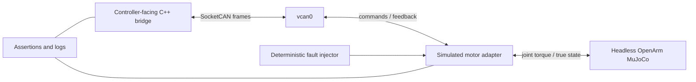

# CAN protocol simulation in CI

Every firmware, CAN serialization, motor-mode, mapping, timing, or bridge change
should run one deterministic Linux `vcan` system test before review. This is a
proposal; the repository does not yet contain the protocol adapter or CI job,
and no hardware result is claimed.

## Concrete test topology



On an Ubuntu runner with SocketCAN support:

```bash
sudo modprobe vcan
sudo ip link add dev vcan0 type vcan
sudo ip link set dev vcan0 up
python -m pytest -q tests/test_can_protocol.py tests/test_can_sim_in_loop.py
```

The proposed tests must be added with the verified protocol adapter; these
commands are not presented as currently passing. The job should:

1. start `vcan0`, the controller-facing bridge, and a simulator adapter using
   distinct validated command/feedback CAN IDs;
2. serialize every motor command field (position, velocity, gain, torque,
   enable/disable), decode it at the adapter, and round-trip representative
   boundary/invalid feedback frames;
3. connect decoded constrained torque to the named seven-joint MuJoCo adapter,
   never raw indices, and publish encoded feedback from true simulated state;
4. execute the existing fixed-seed, in-limit trajectory at the proposed 500 Hz
   host cycle and preserve cycle/fault logs;
5. deterministically drop feedback for one motor, hold an old timestamp, omit
   acknowledgment, duplicate/out-of-order a sequence where supported, inject a
   bus error/status reset, and assert the declared response;
6. verify recovery never jumps from `FAULT` or `ESTOP` to an enabled state.

CI fails on any protocol incompatibility, non-finite value, hard position or
velocity violation, absolute torque request, excessive tracking regression,
watchdog failure, missed required disable, or incorrect safety-state transition.
Tracking uses the broad classified thresholds in `config/openarm_limits.yaml`,
not exact floating-point golden values. The loss/stale cases must prove a
timestamped `FAULT`, stopped trajectory, zero-torque/disable request, and no
subsequent active command.

## What it catches

- incompatible bit packing, scaling, signedness, units, IDs, motor ordering,
  mode fields, and parser changes;
- controller/adapter non-finite propagation and mapping mistakes;
- command saturation or absolute-limit regressions;
- stale/missing-frame watchdog and fault-transition regressions;
- deterministic tracking degradation caused by firmware/protocol-facing host
  changes;
- failure to stop trajectory and issue the declared simulated disable response.

## What it cannot catch

`vcan` has no arbitration timing, bitrate saturation, transceiver faults,
electrical noise, grounding/termination behavior, kernel/driver latency, MCU
execution jitter, real encoder quantization, current-loop dynamics, thermal
limits, torque calibration, backlash/compliance, brakes, mechanical stops, or
physical E-stop/power isolation. It cannot establish safe hardware gains,
temperature limits, zeros, signs, stopping distance, or a formal safety rating.

After CI passes, hardware work still requires bench protocol capture, motor
identity/sign checks with the arm supported, measured timing/utilization,
low-energy single-joint commissioning, independent protection validation, and a
formal risk assessment before coordinated motion.
