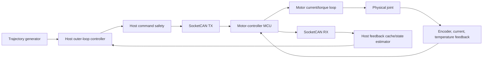

# OpenArm v2 embedded-Linux CAN bridge design

**Status:** design and C++17 skeleton only. No OpenArm hardware, CAN interface,
motor identity, zero calibration, current loop, or physical E-stop was available
for verification. [`can_control_loop.cpp`](can_control_loop.cpp) therefore
refuses activation until a hardware-verified protocol adapter and configuration
are supplied; it is not an unverified driver.

The design uses the official, commit-pinned
[`enactic/openarm_can`](https://github.com/enactic/openarm_can/tree/98666042b5e9cd5b55d0bd1d7fc3aa5c42caae4d)
as the protocol reference. Its MIT-style position, velocity, gain, and torque
packing ranges are transport encodings, **not robot safety limits**. Hardware
limits, CAN IDs, signs, zero offsets, feedback status, acknowledgments, and
temperature thresholds remain configuration/validation gates.

## Data path and ownership

| Host embedded Linux | Motor controller / MCU |
| --- | --- |
| Seven-joint trajectory generation | Encoder sampling and motor-state conversion |
| Outer-loop PD and identified dynamics compensation | Current or torque inner loop |
| Planning, normal-command, and absolute checks | Motor-specific overcurrent and drive protection |
| Command saturation and slew policy | Local command watchdog and immediate execution |
| Monotonic send/receive timestamps and freshness | Temperature/current protection |
| System-level fault state machine and E-stop input monitoring | Hardware fault/status reporting |
| Bounded logging and post-fault evidence | Safe local response if host traffic stops |

The simulation's `qfrc_bias` is not available on a physical robot. A hardware
dynamics estimate must be validated independently; until then, use conservative
gains/torque and do not claim equivalent gravity compensation.

## Proposed 500 Hz host cycle

No pinned official source in the investigation requires a host rate. `500 Hz`
is an **ASSUMED proposed design** matching the tested 2 ms simulation step, not
a measured guarantee.

| 2 ms activity | Proposed budget |
| --- | ---: |
| Drain latest feedback using nonblocking SocketCAN | 250 us |
| Freshness, sequence/status, and acknowledgment checks | 50 us |
| Unit/sign/zero conversion and state-cache update | 100 us |
| Trajectory and outer-loop calculation | 250 us |
| Position/velocity/torque/finite safety checks | 150 us |
| Serialize and enqueue seven CAN commands | 350 us |
| Enqueue one preallocated log record | 100 us |
| Scheduler, jitter, and timing reserve | 750 us |
| **Total** | **2,000 us** |

The CAN allocation measures host serialization/socket enqueue, not guaranteed
wire completion. Before 500 Hz hardware use, measure arbitration delay, bus
rate, frame count, error frames, and worst-case utilization. A single classic
CAN bus may not have enough margin for seven command and seven feedback frames
per 2 ms; use the validated OpenArm bus topology, multiple buses, a lower host
rate, or a verified higher-bandwidth protocol rather than assuming capacity.

## Message loop

The skeleton uses `steady_clock`, absolute 2 ms wakeups, a nonblocking socket,
and a 250 us receive-drain deadline. Each valid decoded feedback frame updates
only its named/configured motor's latest-value cache with host receive time,
host sequence, optional device sequence, status, and acknowledgment. Duplicate,
invalid, missing, and stale frames never become fresh state.

For each motor, the command model exposes position, velocity, `kp`, `kd`, and
feedforward torque because the official protocol supports MIT-style fields.
For the proposed host torque outer loop, `kp=kd=0` and the constrained host
torque occupies the torque field **only after that command semantic and sign are
verified**. If motor-side impedance is selected instead, its gains and targets
require a separate stability/safety validation. The adapter must:

1. verify motor identity, logical joint, command/feedback CAN IDs, sign, zero,
   firmware mode, units, and enable/disable status;
2. encode/decode against pinned `openarm_can` behavior and captured known-good
   frames;
3. reject protocol values outside packing range while using project joint,
   velocity, rated-torque derating, and absolute-torque limits for safety;
4. expose acknowledgment if supported, or define a tested feedback-based
   substitute without inventing a wire sequence field.

Commands over an absolute torque threshold fault; commands inside that boundary
are saturated to normal torque and slew limits. Every cycle checks finite
values, state limits, feedback age, acknowledgment age, motor status/reset,
temperature, send errors, and deadline. Missed-frame/deadline counters and the
first fault reason/time go to a bounded logging queue; disk I/O stays outside
the real-time loop.

## Safety state machine

| State | Meaning and allowed next states |
| --- | --- |
| `DISCONNECTED` | CAN closed/motors untrusted. May enter `CONNECTED_DISABLED` only after communication and disable-state verification. |
| `CONNECTED_DISABLED` | Bus active, torque disabled. May enter `INITIALIZING` or return to `DISCONNECTED`. |
| `INITIALIZING` | Verify seven identities, firmware modes, units, status, freshness, and configured limits. May enter `ZEROING_OR_CALIBRATION` or return disabled. |
| `ZEROING_OR_CALIBRATION` | Supported, low-energy, operator-authorized zero/calibration. May enter `ENABLED_HOLD` only after plausibility checks. |
| `ENABLED_HOLD` | Low-torque validated hold at the safe starting pose. May enter `ACTIVE_CONTROL` or disable. |
| `ACTIVE_CONTROL` | Trajectory advances. May return to `ENABLED_HOLD`; any fault stops trajectory. |
| `FAULT` | Latched software/communication/motor fault. Only manual reset with causes cleared and motors verified disabled may return to `CONNECTED_DISABLED`. |
| `ESTOP` | Physical E-stop/power-isolation response. Only physical reset and reinspection may return to `DISCONNECTED`. |

Any non-`ESTOP` state may enter `FAULT`; any state may enter `ESTOP`.
Prohibited shortcuts include `DISCONNECTED`/`CONNECTED_DISABLED` directly to
hold or active, calibration directly to active, `FAULT` directly to enabled,
and `ESTOP` directly to any powered state.

## Startup sequence

1. Inspect the workspace, supports, harness clearance, mechanical condition,
   and intended left-arm path; keep people outside the swept volume.
2. Confirm an independent physical E-stop is accessible and power isolation is
   functional. Do not proceed on software stop alone.
3. Start logging; open the configured SocketCAN interface with motors disabled.
4. Discover and verify exactly seven configured motor identities, CAN IDs,
   firmware mode/status, joint association, direction, and protocol version.
5. With the arm physically supported, check finite sensors, timestamps,
   plausible position/velocity/current/temperature, and zero consistency.
6. Perform only an approved low-energy zero/calibration procedure. Never drive
   blindly toward a mechanical stop.
7. Confirm a conservative in-limit starting pose, low torque caps, clear path,
   fresh feedback, and local MCU watchdog.
8. Enable one channel/energy stage at a time, verify sign with a small bounded
   command, then transition to low-torque `ENABLED_HOLD`.
9. Require deliberate operator authorization before `ACTIVE_CONTROL`.

## Fault and shutdown policy

| Fault | Host response; required local/physical response |
| --- | --- |
| Stale/missing feedback or acknowledgment | Stop trajectory, latch `FAULT`, request zero torque/disable; MCU watchdog independently disables stale commands. |
| CAN send/read/bus-off error | Fault and disable; require bus recovery plus manual reinitialization. |
| Position, velocity, torque, temperature, or non-finite value | Immediate fault; local drive protections remain authoritative for current/temperature. |
| Missed 2 ms deadline | Fault on the declared policy; record lateness and counters. Never send a late trajectory command as current. |
| Host-process crash | MCU local watchdog must time out and disable torque without host cooperation; a supervisor may log/restart only into `DISCONNECTED`. |
| Motor-controller reset/status change | Fault all active control, disable, reverify identity/zero/mode before initialization. |
| Physical E-stop | Hardware power isolation independent of host; host records `ESTOP` when observable and never auto-resumes. |

Normal shutdown stops trajectory, transitions to a validated low-torque hold
only while feedback and drives are healthy, then sends disable, verifies disabled
status where the protocol permits, closes CAN, and flushes logs. On uncertain
feedback, bus failure, host fault, or E-stop, the declared software default is
zero-torque/disable—not continued hold. A gravity-loaded arm can fall at zero
torque, so physical support, brakes, and the final safe-state policy require a
formal hardware risk assessment.

Software limits and watchdogs do **not** replace an independent physical E-stop,
power isolation, mechanical limits, drive current protection, thermal
protection, or formal risk assessment. See
[`docs/SIMULATION_IN_CI.md`](../docs/SIMULATION_IN_CI.md) for the required
protocol/simulation gate on every communication or firmware change.
